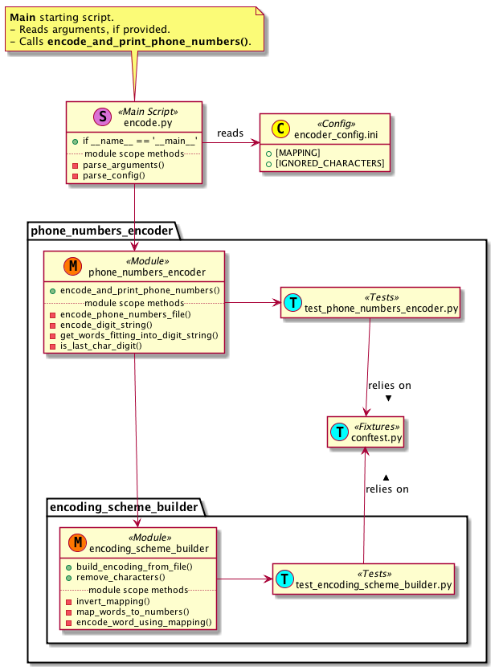

# number-encoding
---
## Requirements
Can be found under `docs/requirements`

## Dependencies
* `Python 3.6`
* `py.test` to run tests (not required)

## Usage
```
usage: encode.py [-h] [-i INPUT_PATH] [-d DICTIONARY_PATH] [-c CONFIG_PATH]

Encode phone numbers.

optional arguments:
  -h, --help            show this help message and exit
  -i INPUT_PATH, --input INPUT_PATH
                        path to input file with phone numbers
  -d DICTIONARY_PATH, --dictionary DICTIONARY_PATH
                        path to dictionary file with words that will be used
                        for encoding
  -c CONFIG_PATH, --config CONFIG_PATH
                        path to config file with digit to char mapping and
                        sets of characters that will be ignored during
                        encoding

```

### Running the script
From the project directory run `python3.6 encode.py`. By default
`docs/requirements/test_dictionary.txt`, `docs/requirements/test_input.txt`
and `encoder_config.ini` files will be used.

## Assumptions
* The script is written to be working under `*nix` system. However, there
  should be no problems with running the script under Windows.

## Design approach
* Main script `encode.py` with arguments for input files
* Config file `encoder_config.ini` with business rules values
* `phone_numbers_encoder` package that actually encodes phone numbers
* `encoding_scheme_builder` package that build encoding schema
* Both packages have their own `py.test` file with unit tests
* Both packages rely on the same `conftest.py` file for fixtures

### Code hierarchy

